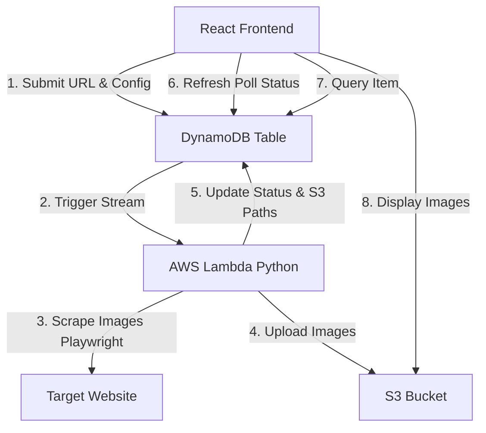

# Image Scraper Application Architecture

This document outlines the architecture and implementation plan for the Serverless Image Scraper application.

## 1. High-Level Architecture



## 2. Component Details

### 2.1 Frontend (Vanilla HTML / CSS / JavaScript)
- **No framework required** — plain `index.html`, `style.css`, and `app.js`.
- **Files:**
    - `frontend/index.html` — page structure and semantic HTML.
    - `frontend/style.css` — dark glassmorphic design system with CSS variables.
    - `frontend/app.js` — all application logic (DynamoDB calls, polling, rendering).
- **UI Sections:**
    - **Scrape Form** — URL input + submit button; calls `PutItem` on DynamoDB.
    - **Status Dashboard** — polls task status every 5 s via `GetItem`; animated status badges.
    - **Image Gallery** — responsive CSS Grid of `` elements loaded from S3.
- **AWS SDK Usage (via DynamoDB HTTP API / fetch):**
    ```javascript
    // Create a task — PutItem
    const taskId = crypto.randomUUID();
    const item = {
      id:        { S: taskId },
      url:       { S: url },
      status:    { S: 'PENDING' },
      timestamp: { N: String(Date.now()) }
    };
    // Send via AWS SDK client or direct HTTP call
    ```
- **Styling**: Dark theme with glassmorphism (`backdrop-filter`), gradient accents, smooth hover/transition micro-animations, responsive grid.
- **Authentication**: Amazon Cognito Identity Pools provide temporary AWS credentials to the browser.
- **Demo mode**: The app runs in a mock/demo mode when AWS credentials are not configured, so the UI can be tested locally without any AWS resources.

### 2.2 Direct DynamoDB Access (AWS SDK)

- The React frontend directly interacts with DynamoDB using the AWS JavaScript SDK.
- Operations performed:
    - `PutItem` to create a new scrape task.
    - `UpdateItem` / `GetItem` to poll task status.
    - `Query` or `Scan` to list all scrape tasks.
- Authentication can be handled via Amazon Cognito Identity Pools or IAM roles.

### 2.3 Data Store (AWS DynamoDB)
- **Table Name:** `ScrapeTasks`
- **Schema:**
    - `id` (Partition Key): Unique UUID for the task.
    - `url` (String): The target URL.
    - `status` (String): `PENDING`, `PROCESSING`, `COMPLETED`, `FAILED`.
    - `config` (Map): Scraping parameters (scroll, min_size, etc.).
    - `results` (List): List of S3 URLs/Keys for the scraped images.
    - `timestamp` (Number): Creation time.

### 2.4 Scraping Engine (AWS Lambda)
- **Runtime:** Python 3.12 (or latest supported)
- **Deployment:** Recommended to use a Docker Container image for Lambda to easily include Playwright and Chromium.
- **Workflow:**
    1. Triggered by DynamoDB Stream (New Image).
    2. Updates status to `PROCESSING` in DynamoDB.
    3. Runs the `image_scraper.py` logic.
    4. Instead of saving to local disk, it streams/uploads the image bytes directly to S3.
    5. Updates DynamoDB record with `status: COMPLETED` and the list of S3 keys.

#### Lambda Code Blueprint (`lambda_function.py`)
```python
import boto3
import json
from image_scraper import scrape_images # Modified to accept S3 upload callback

s3 = boto3.client('s3')
db = boto3.resource('dynamodb').Table('ScrapeTasks')

def lambda_handler(event, context):
    for record in event['Records']:
        if record['eventName'] == 'INSERT':
            new_item = record['dynamodb']['NewImage']
            task_id = new_item['id']['S']
            url = new_item['url']['S']
            
            # Update status to PROCESSING
            db.update_item(
                Key={'id': task_id},
                UpdateExpression="set #s = :s",
                ExpressionAttributeNames={'#s': 'status'},
                ExpressionAttributeValues={':s': 'PROCESSING'}
            )
            
            try:
                # Custom upload function to pass to the scraper
                def s3_upload(filename, body, content_type):
                    s3_key = f"images/{task_id}/{filename}"
                    s3.put_object(
                        Bucket='scraped-images-storage',
                        Key=s3_key,
                        Body=body,
                        ContentType=content_type
                    )
                    return s3_key

                # Trigger the scrape (needs modifications to image_scraper.py)
                results = scrape_images(url, upload_callback=s3_upload)
                
                # Update status to COMPLETED
                db.update_item(
                    Key={'id': task_id},
                    UpdateExpression="set #s = :s, results = :r",
                    ExpressionAttributeNames={'#s': 'status'},
                    ExpressionAttributeValues={
                        ':s': 'COMPLETED',
                        ':r': results
                    }
                )
            except Exception as e:
                db.update_item(
                    Key={'id': task_id},
                    UpdateExpression="set #s = :s, error_message = :e",
                    ExpressionAttributeNames={'#s': 'status'},
                    ExpressionAttributeValues={':s': 'FAILED', ':e': str(e)}
                )
```

#### Dockerfile for Lambda (`Dockerfile`)
```dockerfile
FROM public.ecr.aws/lambda/python:3.12

# Install system dependencies for Playwright
RUN dnf install -y \
    atk \
    cups-libs \
    gtk3 \
    libXcomposite \
    libXcursor \
    libXdamage \
    libXext \
    libXi \
    libXrandr \
    libXscrnsaver \
    libXtst \
    pango \
    at-spi2-atk \
    libXt \
    xorg-x11-server-Xvfb \
    xorg-x11-xauth \
    dbus-glib \
    dbus-glib-devel \
    nss \
    mesa-libgbm \
    alsa-lib

# Copy requirements and install
COPY requirements.txt .
RUN pip install -r requirements.txt

# Install Playwright browsers
RUN playwright install chromium
RUN playwright install-deps chromium

# Copy code
COPY lambda_function.py .
COPY image_scraper.py .

CMD ["lambda_function.lambda_handler"]
```

### 2.5 Storage (AWS S3)
- **Bucket Name:** `scraped-images-storage`
- **Organization:** `images/{task_id}/{filename}`.
- **Configuration:** Needs CORS enabled to allow the React app to display images.

## 3. Frontend Implementation Details (Vanilla JS)

### 3.1 Create Task (PutItem)
```javascript
// app.js — createTask()
async function createTask(url) {
  const taskId = crypto.randomUUID();
  const item = {
    id:        { S: taskId },
    url:       { S: url },
    status:    { S: 'PENDING' },
    timestamp: { N: String(Date.now()) }
  };
  // Send PutItemCommand to DynamoDB (via AWS SDK or HTTP)
  return taskId;
}
```

### 3.2 Poll Status (GetItem)
```javascript
// app.js — fetchTaskStatus()
async function fetchTaskStatus(taskId) {
  // GetItemCommand with Key: { id: { S: taskId } }
  // Returns { status, results, error_message }
}
// Called every 5 seconds; stops on COMPLETED / FAILED.
```

### 3.3 Render Gallery
```javascript
function renderGallery(results) {
  results.forEach(key => {
    const img = document.createElement('img');
    img.src = `https://scraped-images-storage.s3.amazonaws.com/${key}`;
    galleryGrid.appendChild(img);
  });
}
```

## 4. Implementation Steps

### Phase 1: Infrastructure (Terraform/CDK/Manual)
1. Create S3 Bucket with CORS.
2. Create DynamoDB Table with Streams enabled.
3. Create Lambda Function with necessary layers/container support.
4. Set up IAM roles allowing Lambda to read/write DynamoDB and S3.

### Phase 2: Lambda Development
1. Adapt `image_scraper.py` to:
    - Receive events from DynamoDB.
    - Upload to S3 using `boto3` instead of `Path.write_bytes`.
    - Handle the Playwright environment within Lambda constraints.

### Phase 3: Frontend Development
1. Open `frontend/index.html` directly in a browser (no build step).
2. Configure Cognito Identity Pool ID in `app.js` for AWS credentials.
3. Test end-to-end: submit URL → poll status → view images.

### Phase 4: Integration & Testing
1. End-to-end testing of the flow.
2. Optimization of scraper (timeouts, memory, concurrency).
